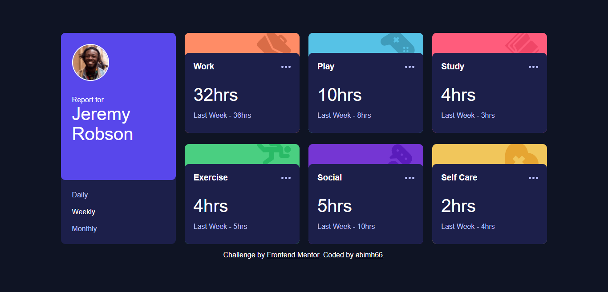
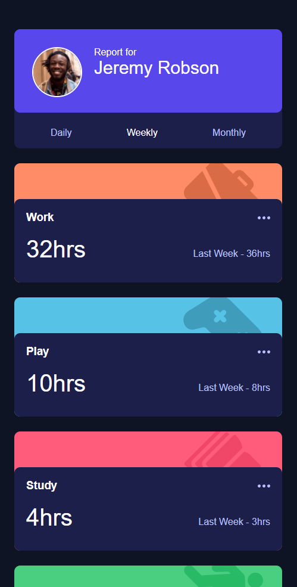

# Frontend Mentor - Time tracking dashboard

Project ini berdasarkan pada challenge di Frontend Mentor [Time tracking dashboard challenge on Frontend Mentor](https://www.frontendmentor.io/challenges/time-tracking-dashboard-UIQ7167Jw).

## Daftar Isi

- [Overview](#overview)
  - [Penjelasan Project](#the-challenge)
  - [Screenshot](#screenshot)
  - [Links](#links)
- [Proses](#proses)
  - [Stack yang digunakan](#stack-yang-digunakan)
  - [Hal yang dipelajari](#hal-yang-dipelajari)
  - [Resources](#resources)
- [Author](#author)

## Overview

### Penjelasan Project

Pada project ini saya membangun sebuah dashboard time tracking yang semirip mungkin dengan desain yang diberikan oleh Frontend Mentor. Saya juga diberikan sebuah data.JSON berisi data waktu aktivitas per hari, minggu, dan bulan. Dari data tesebut saya menampilkan secara dinamis(sesuai dengan pilihan waktu yang dipilih) dengan javascript
Fokus utama pada project ini adalah HTML, CSS, dan javascript.
Objektif pada project ini:

- Menampilkan layout yang sesuai dengan ukuran layar(responsive)
- Memberikan interaksi pada web
- User dapat mengganti tampilan statistik berdasarkan hari, minggu, atau bulan

### Screenshot

**Tampilan Desktop**

**Tampilan Mobile** 

### Links

- Solution URL: [Solution Codee](https://github.com/abimh66/sunnyside-agency-landing-page-main)
- Live Site URL: [live site](https://sunnyside-abimh66.netlify.app/)

## Proses

### Stack yang digunakan

- Semantic HTML5 markup
- CSS Grid
- CSS Flexbox
- Desktop-first workflow
- Vanilla JavaScript

### Hal yang dipelajari

Salah satu hal yang saya pelajari dari mengerjakan project ini adalah CSS grid. Kemudian saya juga belajar tentang _async function_ di javascript untuk mendapatkan data dari json.

### Resources

- [Mozilla MDN JavaScript Documentation](https://developer.mozilla.org/en-US/docs/Web/JavaScript)

## Author

- Website - [abiproject.com](https://www.abiproject.com)
- Frontend Mentor - [@abimh66](https://www.frontendmentor.io/profile/abimh66)
- Codewars - [@abimh66](https://www.codewars.com/users/abimh66)
- Twitter - [@abimhrdnt](https://www.twitter.com/abimhrdnt)
